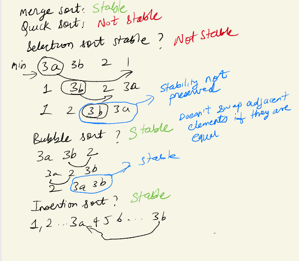

# selection-sort

# selection vs bubble:
- bubble has more exchanges
- it is stable
- Both sort finds the ith smallest element at ith iteration and puts it in the ith index.
- long range swaps make selection sort unstable.
- both are insensitive to input and will do n^2 compares even for sorted array